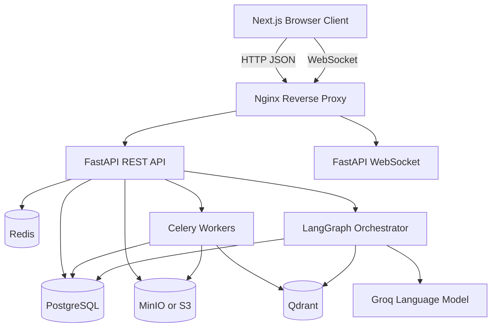
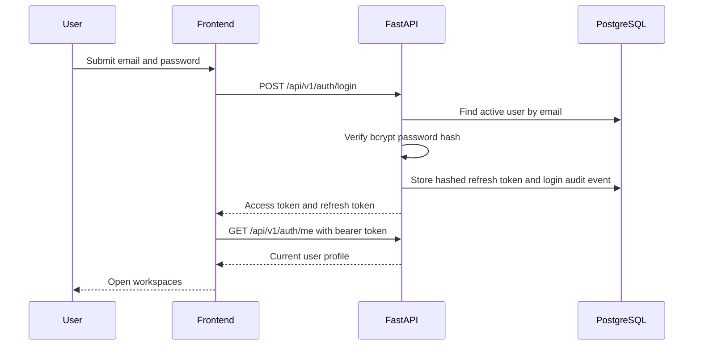
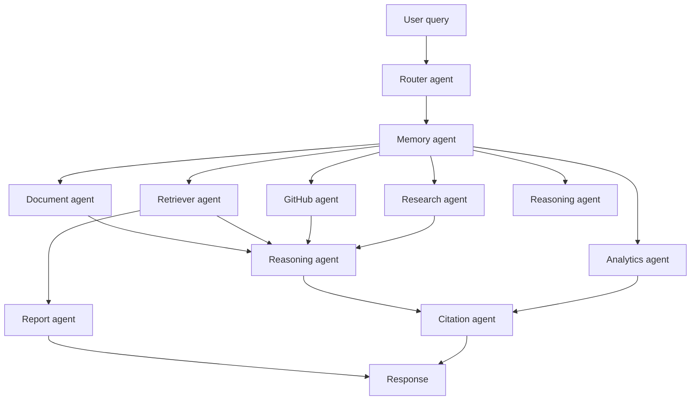

# Atlas AI Project Guide

## 1. Purpose

Atlas AI is a full-stack, multi-tenant enterprise knowledge workspace. It gives a company one place to store organizational knowledge, search it with natural language, ask questions about documents, connect GitHub repositories, and generate AI-assisted insights.

The central idea is Retrieval-Augmented Generation (RAG): the system retrieves relevant internal information first, then provides that information to a language model so responses can be grounded in the organization's knowledge base.

Atlas AI is designed as a private combination of:

- A document knowledge base
- Semantic and hybrid search
- An AI chat assistant
- Workspace administration
- GitHub knowledge integration
- Analytics and report generation

This document describes the current repository from A to Z. It focuses on behavior represented in the code, not only planned product requirements.

## 2. High-Level Architecture



### Request flow

1. A user interacts with the Next.js frontend.
2. Axios sends requests to the FastAPI API with a bearer access token.
3. Nginx can route `/api/` traffic to FastAPI in a containerized deployment.
4. FastAPI authenticates the user and checks workspace membership and role.
5. PostgreSQL stores users, workspaces, documents, messages, audit data, and analytics events.
6. Redis supports rate limiting and Celery queue coordination.
7. MinIO or S3 stores uploaded files.
8. Qdrant stores document embeddings for semantic retrieval.
9. LangGraph coordinates routing, memory, retrieval, reasoning, citations, and reports.
10. Responses are returned as JSON, Server-Sent Events, or WebSocket messages depending on the feature.

## 3. Repository Layout

```text
atlas-ai/
├── backend/
│   ├── app/
│   │   ├── api/              FastAPI dependencies and versioned routes
│   │   ├── ai/               LangGraph agents and RAG pipeline
│   │   ├── core/             Configuration, security, database, Redis, guards
│   │   ├── models/           SQLAlchemy database models
│   │   ├── schemas/          Pydantic request and response schemas
│   │   ├── services/         Authentication, email, and storage services
│   │   └── workers/          Celery application and task queues
│   ├── alembic/              Database migrations
│   ├── scripts/seed.py       Demo users, workspaces, and documents
│   ├── tests/                API and integration tests
│   └── unit_tests/           Focused unit tests
├── frontend/
│   ├── src/app/              Next.js App Router pages
│   ├── src/components/       Reusable interface components
│   ├── src/hooks/            Client-side hooks
│   ├── src/lib/api.ts        Axios client and API helpers
│   └── src/store/             Zustand authentication and workspace state
├── docs/
│   ├── SRS.md                Product requirements and design specification
│   ├── PROJECT_GUIDE.md      This end-to-end technical guide
│   └── screenshots/           README product screenshots
├── infrastructure/
│   ├── nginx/                Reverse proxy configuration
│   ├── prometheus/           Metrics configuration
│   └── grafana/               Dashboard configuration
├── docker-compose.yml        Local services and application containers
├── Makefile                  Common development commands
└── .github/workflows/        CI and optional deployment workflow
```

## 4. Frontend Architecture

The frontend is a Next.js 14 application using the App Router, React, TypeScript, Tailwind CSS, Zustand, React Query, Axios, and reusable UI components.

### Main user areas

- Public landing and welcome page
- Registration and login
- Email verification
- Forgot-password and reset-password flows
- Workspace selection and creation
- Workspace dashboard
- Chat
- Search
- Documents and folders
- GitHub repositories
- Analytics
- Reports
- Notifications
- Profile and settings
- Billing and help
- Super-admin controls

### Authentication in the browser

The login page sends credentials to `POST /api/v1/auth/login`. After receiving the access and refresh tokens, it stores them locally, requests the current user from `/api/v1/auth/me`, and persists the authenticated state through Zustand.

The Axios client attaches the access token to API requests. When an authenticated request returns `401`, it attempts a refresh-token request, updates the stored tokens, retries the failed request, and redirects to `/login` if refresh fails.

The frontend API base URL can be configured with `NEXT_PUBLIC_API_URL`. When it is empty, requests use the current origin, which allows Nginx to proxy `/api/` requests without exposing a hard-coded server address.

### Client state

- `auth.store.ts` persists the current user and token state.
- `workspace.store.ts` tracks the active workspace.
- React Query manages server data, caching, loading states, and refetching.
- WebSocket and SSE connections support live chat and processing updates.

## 5. Backend Architecture

The backend is a FastAPI application mounted under `/api/v1`. It uses asynchronous SQLAlchemy sessions and Pydantic schemas.

### API groups

| Prefix | Responsibility |
| --- | --- |
| `/auth` | Registration, login, refresh, logout, profile, verification, password reset, OAuth |
| `/workspaces` | Workspace CRUD, members, settings, storage, documents, chat, search, GitHub, analytics, reports |
| `/notifications` | User notifications |
| `/admin` | Administrative user and workspace operations |
| `/ws` | WebSocket communication for live updates |
| `/health` | Basic service health |
| `/health/detailed` | Database and Redis health checks |
| `/metrics` | Basic Prometheus-compatible service metrics |

### Request lifecycle

1. FastAPI receives the request.
2. Middleware records request timing and adds an `X-Response-Time` header.
3. CORS rules validate browser origins.
4. Authentication dependencies decode the bearer token and load the user.
5. Workspace dependencies validate membership and role where required.
6. The route executes database or service operations.
7. The response is serialized through a Pydantic schema or explicit JSON response.
8. Important write operations create audit events where supported.

## 6. Authentication and Authorization

Atlas AI uses stateless JWT access tokens plus persisted, hashed refresh tokens.

### Login flow



Implemented security behavior includes:

- Password hashing with the configured password hashing utility
- JWT access tokens with a default 15-minute lifetime
- Refresh tokens with a default 7-day lifetime
- Refresh-token rotation and revocation
- Failed-login counting and temporary account lockout
- Role checks for workspace and admin operations
- Email verification and password reset token flows
- Optional Google and GitHub OAuth callbacks
- Redis-backed authentication rate limiting that fails open if Redis is unavailable
- Prompt input protection and input sanitization utilities
- CORS and production trusted-host configuration

Never use the demo credentials or local secret values in production.

## 7. Multi-Tenancy and Workspace Isolation

A workspace is the main tenant boundary. Users belong to workspaces through membership records, and membership records carry roles.

The isolation model has three layers:

1. PostgreSQL records include workspace ownership or workspace membership relationships.
2. API dependencies validate that the current user belongs to the requested workspace and has the required role.
3. Qdrant collections and S3 object paths are associated with a workspace so retrieval and files can remain tenant-scoped.

The intended roles are `super_admin`, `workspace_admin`, `manager`, `employee`, and `guest`. Administrative routes use role dependencies rather than relying only on frontend visibility.

## 8. Document Ingestion Pipeline

Documents are stored in object storage and represented in PostgreSQL. Processing is performed asynchronously so uploading a large file does not block the API request.

```mermaid
flowchart LR
    Upload[Upload file] --> Validate[Validate type and size]
    Validate --> Store[Store original in S3 or MinIO]
    Store --> Extract[Extract text and metadata]
    Extract --> Clean[Clean and normalize text]
    Clean --> Chunk[Create overlapping chunks]
    Chunk --> Embed[Create vector embeddings]
    Embed --> Index[Upsert vectors in Qdrant]
    Index --> Complete[Mark document completed]
```



Supported processing paths include PDF, DOCX, PPTX, XLSX, Markdown, text, CSV, HTML, and notebook content as represented by the extraction pipeline and requirements.

The pipeline records useful metadata such as:

- File type and file size
- Content hash for deduplication
- Page, slide, sheet, or word information where available
- Processing status and errors
- Chunk count and token counts
- Embedding model information
- Folder and workspace relationships

The configured chunking design targets 512 tokens with 64-token overlap. Chunking at semantic boundaries helps preserve context while keeping retrieval units manageable.

## 9. RAG and Search Architecture

RAG is the central AI pattern in Atlas AI.

### Indexing

1. Extract text from the uploaded source.
2. Normalize the text and remove unusable control characters.
3. Split the content into chunks.
4. Generate an embedding for each chunk.
5. Store the vector and metadata in a workspace-specific Qdrant collection.
6. Store relational document and chunk metadata in PostgreSQL.

### Retrieval

The intended retrieval path combines:

- Dense vector similarity from Qdrant
- Lexical or BM25-style matching
- Reciprocal Rank Fusion to combine result lists
- Cross-encoder reranking where configured
- Workspace, file-type, source, and document filters
- Top-K context selection for the language model

### Grounded generation

After relevant chunks are retrieved:

1. The selected context is provided to the reasoning agent.
2. The language model drafts an answer using the supplied context.
3. The citation agent maps claims to source documents and pages where possible.
4. A confidence score is calculated from retrieval information.
5. The response is returned with answer text, citations, confidence, and agent metadata.

If retrieval or the live model call fails, the orchestrator includes fallback behavior. Fallback responses should be treated as a resilience feature, not as a replacement for a valid API key and a correctly configured knowledge base.

## 10. LangGraph Multi-Agent System

The orchestrator builds a conditional LangGraph workflow.



### Agents

- **Router agent:** classifies the request intent.
- **Memory agent:** loads recent conversation context.
- **Document agent:** handles document-scoped questions.
- **Retriever agent:** performs general workspace retrieval.
- **GitHub agent:** handles repository-scoped knowledge.
- **Research agent:** handles research-oriented questions.
- **Reasoning agent:** creates the main language-model response.
- **Citation agent:** adds source mappings and confidence information.
- **Analytics agent:** answers workspace metric questions.
- **Report agent:** creates structured report responses.

The graph supports intents such as document questions, code explanations, research, general chat, reports, comparisons, summarization, and analytics.

## 11. Chat and Streaming

Chat sessions and messages are stored in PostgreSQL. A session tracks its workspace, user, title, mode, archive state, pin state, and message count.

Chat supports:

- General, document, code, and research modes
- Conversation history
- Streaming response events
- Citations
- Confidence values
- Pinned and archived sessions
- Suggested prompts
- Markdown or JSON export paths

The orchestrator currently yields response tokens incrementally after graph execution. The API can expose streaming results to the frontend using Server-Sent Events, while WebSockets are used for live status updates such as document processing.

## 12. GitHub Integration

Users can connect public or private repositories through the workspace repository routes. The integration stores repository metadata and can use a personal access token for private access.

The repository workflow can:

1. Register a repository against a workspace.
2. Fetch README and documentation content.
3. Optionally process source code.
4. Convert repository content into searchable knowledge.
5. Trigger a manual synchronization.
6. Track synchronization status and errors.

Repository credentials must be handled as secrets. The current code contains areas marked for stronger token encryption before production use, so this feature requires a security review before handling sensitive enterprise repositories.

## 13. Analytics and Metrics

Analytics are implemented at both workspace and service levels.

### Workspace metrics

The analytics API calculates:

- Total active documents
- Documents with completed processing
- Chat sessions in the last 30 days
- User queries in the last 30 days
- Document counts and storage by file type
- Chat messages grouped by day
- Total searches in a selected period
- Unique queries
- Top queries
- Zero-result queries

Search events store the query, result count, workspace, user, and timestamp in the analytics events table.

### AI response metadata

AI responses can include:

- Citations
- Confidence score
- Estimated token usage
- Latency fields in message models
- Agents invoked

Token values are estimates in the reasoning path, not a provider billing export. Confidence is a retrieval-derived application score, not a formally validated accuracy percentage.

### Service metrics

The `/metrics` endpoint exposes basic Prometheus-compatible values, including an API-up indicator and Redis uptime. Request middleware also records response duration in logs and exposes `X-Response-Time` on responses.

## 14. Data Model

The primary relational entities include:

- `users`: identities, password state, verification, lockout, and profile data
- `refresh_tokens`: hashed, rotating refresh-token records
- `user_sessions`: active user sessions and device metadata
- `workspaces`: tenant information, settings, tier, and storage usage
- `workspace_members`: users, workspaces, and roles
- `folders`: document hierarchy
- `documents`: file metadata, status, ownership, and processing information
- `document_chunks`: extracted chunks and token metadata
- `document_versions`: document history
- `github_repositories`: connected repository metadata and sync state
- `chat_sessions`: conversations and workspace association
- `messages`: user and assistant messages, citations, confidence, and latency
- `reports`: generated report records
- `audit_logs`: security and write-operation history
- `notifications`: user-facing notifications
- `analytics_events`: search and workspace activity events
- `api_keys`: API key records and hashes

PostgreSQL is the source of truth for relational data. Qdrant is the source of truth for vector indexes, while MinIO or S3 is the source of truth for original uploaded files.

## 15. Background Processing

Celery workers handle work that should not block an HTTP request. Queues are separated so workloads can scale independently.

Typical task categories include:

- Document extraction and indexing
- GitHub synchronization
- Report generation
- AI-related background tasks

Redis provides the broker and result backend configuration. A worker process must be running for asynchronous document and report workflows to complete.

## 16. Storage and External Services

| Service | Purpose | Required for login? |
| --- | --- | --- |
| PostgreSQL | Users, workspaces, documents, messages, tokens | Yes |
| Redis | Rate limiting, Celery broker, cache coordination | Recommended, but auth limiter fails open |
| Qdrant | Embeddings and semantic retrieval | No, unless using RAG/search |
| MinIO or S3 | Uploaded file storage | No, unless using file features |
| Groq | Language-model generation | No for password login; required for generative AI |
| SMTP provider | Verification and password-reset email | No for basic local login |

Each developer must configure their own API key. Never commit a real `GROQ_API_KEY`, database password, JWT secret, GitHub token, or storage credential.

## 17. Local Development

### Configuration

Copy the safe template and create a local environment file:

```bash
cp .env.example .env
```

Set your own API key:

```env
GROQ_API_KEY=your-own-groq-api-key
```

For manual backend execution, use local service hostnames such as `localhost`. Docker Compose uses service hostnames such as `postgres`, `redis`, `qdrant`, and `minio` inside the container network.

### Docker workflow

```bash
docker compose up -d
docker compose exec backend alembic upgrade head
docker compose exec backend python scripts/seed.py
```

### Manual backend workflow

```bash
cd backend
python -m venv venv
source venv/bin/activate
pip install -r requirements.txt
alembic upgrade head
python scripts/seed.py
python -m uvicorn app.main:app --reload --port 8000
```

On Windows Git Bash:

```bash
source venv/Scripts/activate
```

### Frontend workflow

```bash
cd frontend
npm install
npm run dev
```

The frontend runs at `http://localhost:3000`. The backend API runs at `http://localhost:8000` and its development docs run at `http://localhost:8000/docs`.

## 18. Demo Data

The seed script creates demo workspaces, users, and knowledge documents for local demonstrations. Example accounts include:

| Role | Email | Password |
| --- | --- | --- |
| Super Admin | `admin@atlas-ai.com` | `Admin@123456` |
| Engineer | `dev@technova.com` | `Demo@123456` |
| HR Manager | `hr@technova.com` | `Demo@123456` |
| Researcher | `researcher@atlas-ai.com` | `Demo@123456` |

These credentials are for local development only.

## 19. Deployment Architecture

The deployment workflow can build backend and frontend images, push them to a configured container registry, connect to a deployment server over SSH, pull the images, restart Docker Compose, and run Alembic migrations.

Automatic deployment is currently disabled in `.github/workflows/deploy.yml`; the workflow is available through `workflow_dispatch` for a deliberate manual run.

A production deployment requires GitHub environment secrets for the registry and SSH connection. It also requires production environment values for the database, Redis, storage, AI provider, JWT secret, CORS origins, OAuth callbacks, and email provider.

Nginx provides the production routing boundary:

- `/api/` routes to FastAPI
- `/health` and `/docs` route to FastAPI
- Other browser routes route to Next.js
- Headers, request limits, and proxy settings are applied at the edge

## 20. Testing and Quality

Run backend tests with:

```bash
cd backend
pytest tests/ -v
```

Run frontend type checking with:

```bash
cd frontend
npm run type-check
```

The backend test suite includes authentication, health, security, workspace, AI pipeline, and unit tests. The current SQLite test fixture cannot create PostgreSQL-specific `ARRAY` columns used by the model set, so integration tests should be run against PostgreSQL or the fixture should be adapted before using the result as a complete quality signal.

## 21. Security Checklist

Before production use:

- Generate a strong random `SECRET_KEY`.
- Configure a real PostgreSQL database with restricted credentials.
- Set a real `GROQ_API_KEY` through deployment secrets.
- Configure `ALLOWED_ORIGINS` to the actual frontend domain.
- Configure production trusted hosts and HTTPS.
- Use secure object-storage credentials and private buckets.
- Encrypt GitHub personal access tokens at rest.
- Configure SMTP for verification and password-reset mail.
- Review rate limits and abuse protection.
- Run migrations through a controlled release process.
- Do not use seeded demo passwords.
- Do not commit `.env`, private keys, tokens, or generated build directories.

## 22. Known Limitations

The following points matter when evaluating or presenting the project:

- RAG accuracy, retrieval recall, and answer faithfulness have not been formally benchmarked.
- Token usage is estimated by the application rather than read from provider billing data.
- The default integration test fixture is SQLite-compatible only for models without PostgreSQL-only types.
- AI features require the developer or deployment owner to provide a valid API key.
- Some integrations, especially GitHub token storage and production infrastructure, need additional hardening before handling sensitive production data.
- The Prometheus endpoint is currently a basic compatibility endpoint rather than a full request counter and histogram implementation.

## 23. Interview Summary

A concise technical explanation is:

> Atlas AI is a multi-tenant enterprise RAG platform. Users upload documents into isolated workspaces, the backend extracts and chunks the content, generates embeddings, and indexes them in Qdrant. When a user asks a question, LangGraph routes the request through specialized agents, retrieves relevant workspace context, generates a grounded answer, and returns citations and confidence metadata. PostgreSQL stores application state, Redis supports queues and rate limiting, Celery handles background processing, and Next.js provides the web interface.

The strongest measurable implementation facts are:

- 4 seeded demo workspaces
- 60+ seeded knowledge documents
- 512-token target chunks with 64-token overlap
- 15-minute access-token lifetime
- 7-day rotating refresh-token lifetime
- Analytics for documents, chats, searches, top queries, and zero-result queries
- Multiple specialized agents coordinated through a conditional LangGraph workflow
